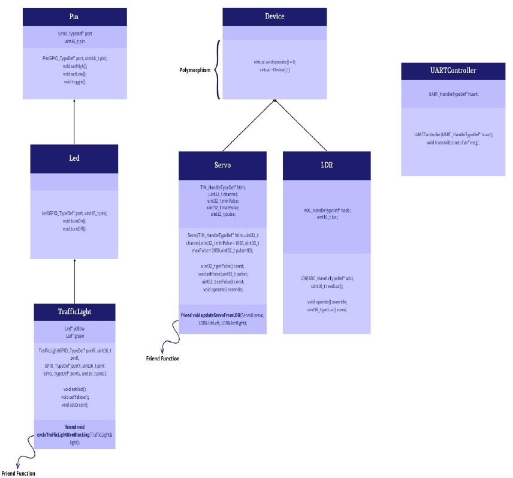

# ☀️ Suntrack Traffic System (Solar-Powered)

### Overview
Designed and implemented a solar-tracking system on STM32, integrated into a traffic light prototype.  
This project demonstrates renewable energy integration into smart urban systems.

### Features
- **LDR-based sun tracking** algorithm implemented in C++ (OOP)
- Solar-powered traffic light prototype
- Li-ion battery circuit with BMS for safe storage and regulation
- Object-oriented programming structure for modular design
- Demonstrated renewable-powered autonomous urban traffic control

### Tech Stack
STM32 Nucleo-L76RG, C++ (OOP), LDR sensors, Li-ion batteries, BMS

### Media
- 📊 Class Diagram: 
- 🎥 [Demo Video](https://youtu.be/yyyy)

### Contributions
- Designed and programmed a solar tracking system on STM32 Nucleo-L76RG in C++ (OOP) using LDR sensors.
- Created a 2S Li-ion battery circuit with BMS and LM7805 for efficient and safe power regulation.
- Deployed solar-powered traffic lights, demonstrating renewable integration in autonomous urban systems.
